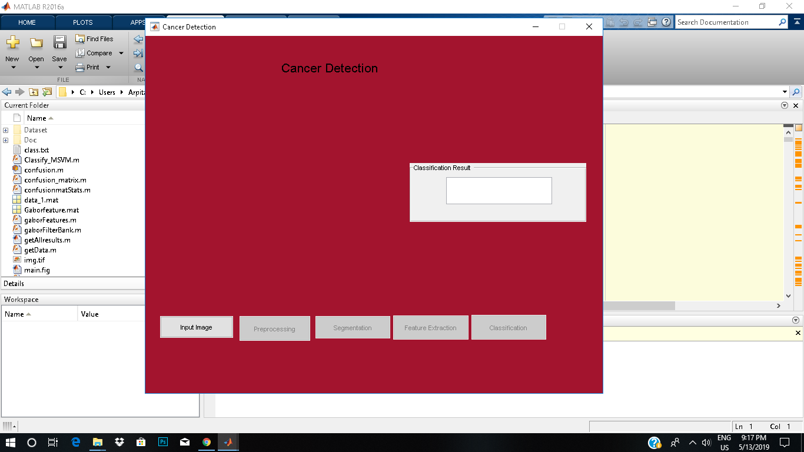
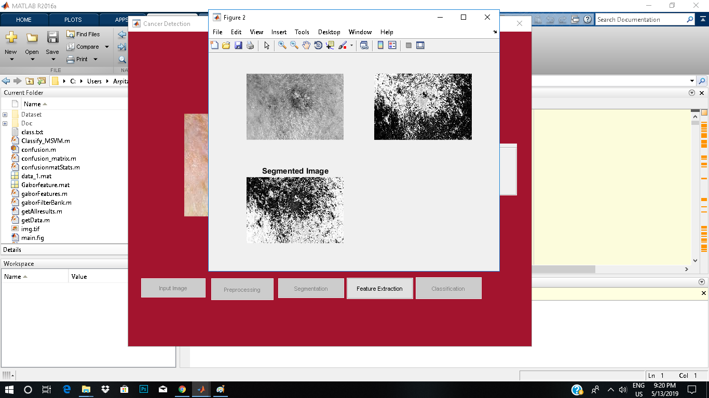

# Skin-Cancer-Detection-System-using-Image-Processing
Major Project of final semester
Cancer image classification is an important task to generate classification maps as no of world observation cancer increasing day by day 
These cancer contains different tools capable of capturing imagery time to time and utilized for a wide range of application. 
Thus classification of cancer imagery has current area of researches and classification results can be used for different real-time application.
This system proposed a novel approach for classification of six different classes:
actinic keratosis, Basel cell carcinoma, cherry nevus, dermatofibroma, Melanocytic nevus and Melanoma by utilizing Cancer imagery. 

 ## Screenshots
 
 
  
  
   
    
     
      

## Technologies Used
* MATLAB
* GLCM
* SVM
* Image Processing
* Gabor Filtering

